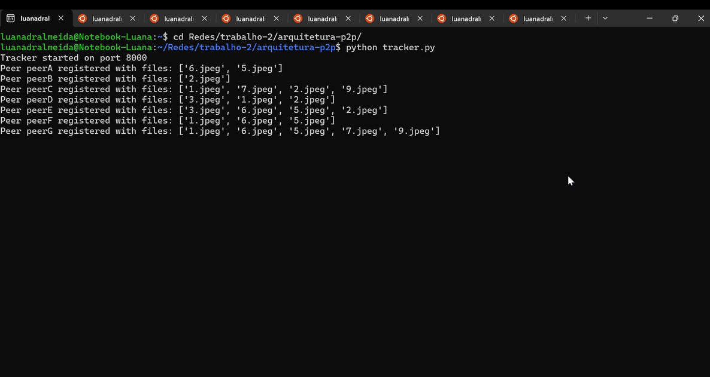

# Arquitetura P2P para Compartilhamento de Arquivos

Este projeto implementa uma rede P2P básica com troca de arquivos divididos em blocos em uma rede local.
Ele é composto por dois tipos de processos:

🔹 **Tracker** → Responsável por registrar peers e armazenar quem possui quais arquivos
🔹 **Peer** → Cada peer possui seus próprios arquivos, baixa arquivos de outros peers e notifica o tracker quando recebe novos

---

## 📌 Estrutura do Projeto

```bash
/project_root
├── tracker.py        # Servidor central de registro (Tracker)
├── peer.py           # Implementação de um peer
├── file.py           # Manipulação de arquivos por blocos
└── tests.py          # Testes de desempenho e estabilidade
```

Cada peer deve possuir um diretório próprio contendo seus arquivos:

```
peer_id/
└── files/
      ├── arquivo1.txt
      ├── imagem.jpg
      └── ...
```

---

## 🚀 Execução do Projeto

### 1. Iniciar o Tracker

O tracker é o servidor central que administra os peers ativos:

```bash
python tracker.py
```

Ele inicia automaticamente na porta **8000** e exibe o IP onde está disponível.

---

### 2. Iniciar um Peer

Cada peer deve ser iniciado com:

```bash
python peer.py <PEER_ID> <PORT> <TRACKER_IP>
```

Exemplo:

```bash
python peer.py A 9000 127.0.0.1
python peer.py B 9001 127.0.0.1
```

**Requisitos:**

✔ O diretório `<PEER_ID>/files` deve existir
✔ Todos os arquivos dentro dele serão registrados no tracker ao iniciar

---

## 📂 Principais Funcionalidades

| Componente           | Função                                                                                              |
| -------------------- | --------------------------------------------------------------------------------------------------- |
| **Tracker**          | Registra peers, responde consultas de quem possui determinado arquivo e atualiza seus catálogos     |
| **Peer**             | Envia e recebe blocos de arquivos, reconstrói arquivos e informa o tracker quando baixa novos itens |
| **Files (file.py)**  | Fragmenta e reconstrói arquivos em blocos de até 4096 bytes (4 kB)                                  |
| **Tests (tests.py)** | Executa testes de desempenho e estabilidade da rede P2P                                             |

---

## 🔧 Comandos Disponíveis no Peer

Dentro do terminal do Peer:

| Comando                       | Função                                                               |
| ----------------------------- | -------------------------------------------------------------------- |
| `get <filename>`              | Baixa um arquivo de outros peers                                     |
| `myfiles`                     | Lista arquivos locais                                                |
| `whohas <filename>`           | Consulta ao tracker quem possui o arquivo                            |
| `bench <filename> [runs]`     | Executa **testes de desempenho** baixando o arquivo repetidas vezes  |
| `stress <filename> [threads]` | Executa **testes de estabilidade** com múltiplos downloads paralelos |
| `exit`                        | Encerra o peer e desconecta do tracker                               |

---

## ⚡ Testes de Desempenho e Estabilidade

O projeto inclui um módulo específico (`tests.py`) para avaliação do sistema.

### 🔸 Benchmark – Teste de Desempenho

Executa múltiplos downloads sequenciais do mesmo arquivo, medindo:

* tempo por download
* média total
* registro automático no `download_times.csv`

Exemplo:

```bash
bench video.mp4 5
```

(Roda 5 downloads seguidos)

---

### 🔸 Stress Test – Teste de Estabilidade

Cria várias threads simultâneas solicitando o mesmo arquivo, útil para avaliar:

* concorrência
* carga sobre a rede
* estabilidade dos peers
* consistência da transferência

Exemplo:

```bash
stress video.mp4 20
```

(Roda 20 downloads simultâneos)

---

## 📥 Processo de Download (Resumo Interno)

1. Peer pergunta ao tracker quem possui o arquivo
2. Conecta a todos os peers que têm o arquivo
3. Recebe **meta-informação** (número de blocos + tamanho total)
4. Baixa blocos em paralelo, protegidos por locks
5. Reconstrói o arquivo localmente
6. Salva em `<peer_id>/files/`
7. Informa ao tracker via **NEW_FILE**

---

## 🧪 Exemplo de Execução

[](./src/exemplo.mp4)